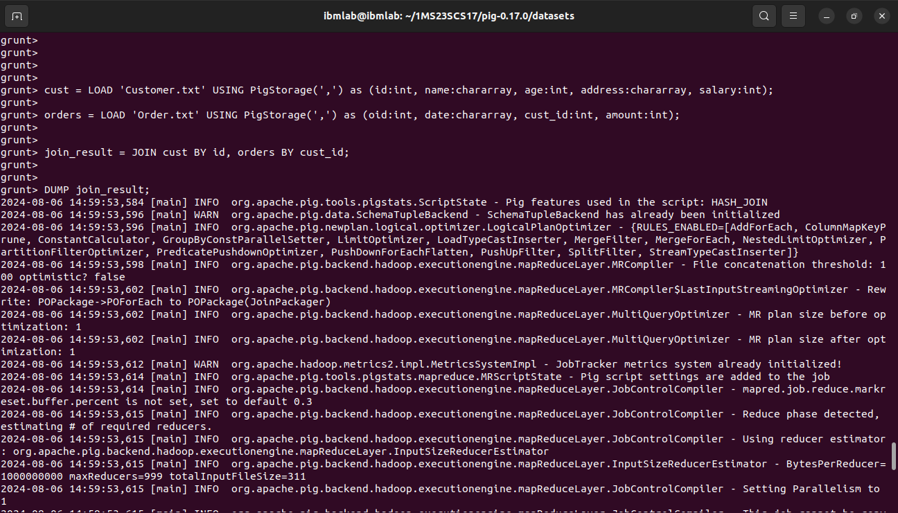
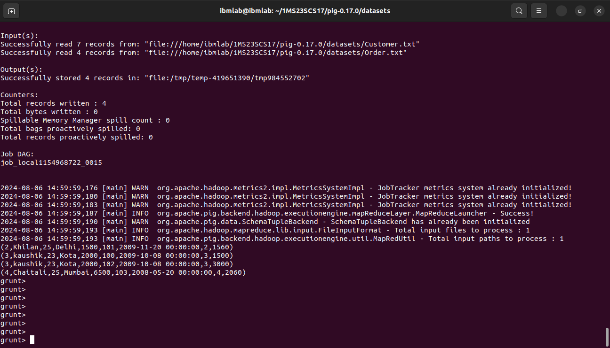
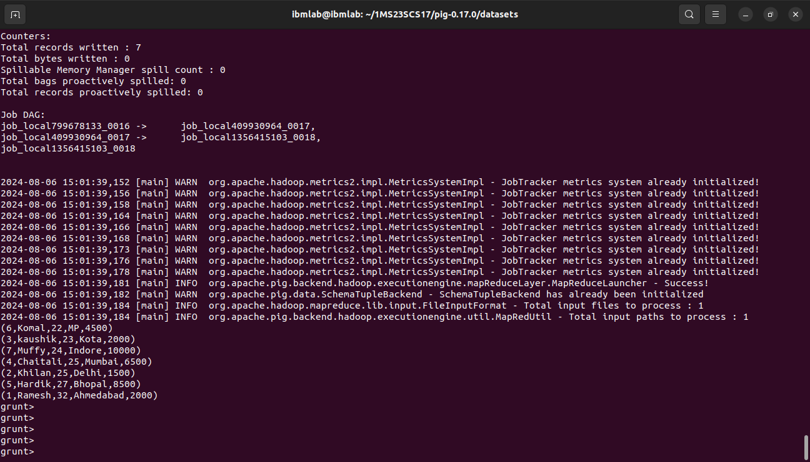
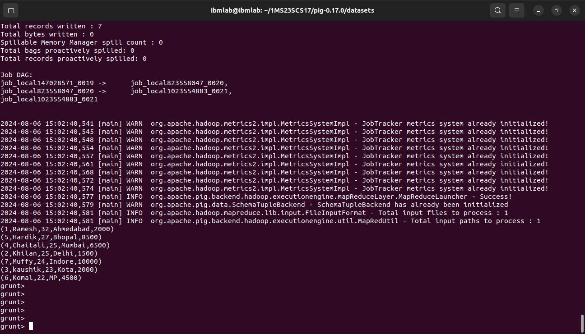

## `Program 2`

Write Pig Latin scripts to JOIN and SORT Customer_details.txt and Order_details.txt data.
* JOIN customers BY id;
* ORDER BY age ASC/ DESC;

1. Load the datasets located in the current directory where `pig` command was invoked.
```sh
cust = LOAD 'Customer.txt' USING PigStorage(',') as (id:int, name:chararray, age:int, address:chararray, salary:int);
orders = LOAD 'Order.txt' USING PigStorage(',') as (oid:int, date:chararray, cust_id:int, amount:int);
```


2. Use `JOIN` operation on both of datasets using **id** from *Customer.txt* and **cust_id** from *Order.txt*.
```sh
join_result = JOIN cust BY id, orders BY cust_id;

DUMP join_result;
```


3. Use `ORDER` command on **Customer.txt** dataset by **age** in ascending order and display the output.
```sh
age_order_asc = ORDER cust BY age ASC;

DUMP age_order_asc;
```


4. Use `ORDER` command on **Customer.txt** dataset by **age** in descending order and display the output.
```sh
age_order_desc = ORDER cust BY age DESC;

DUMP age_order_desc;
```
