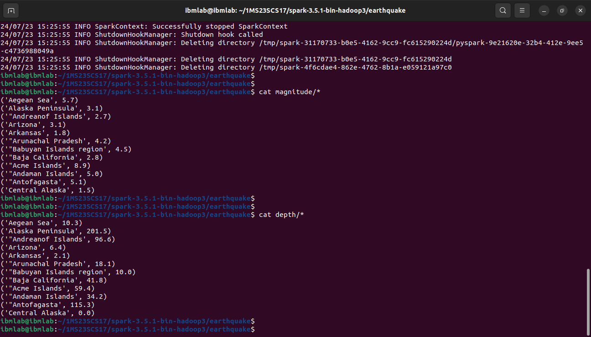
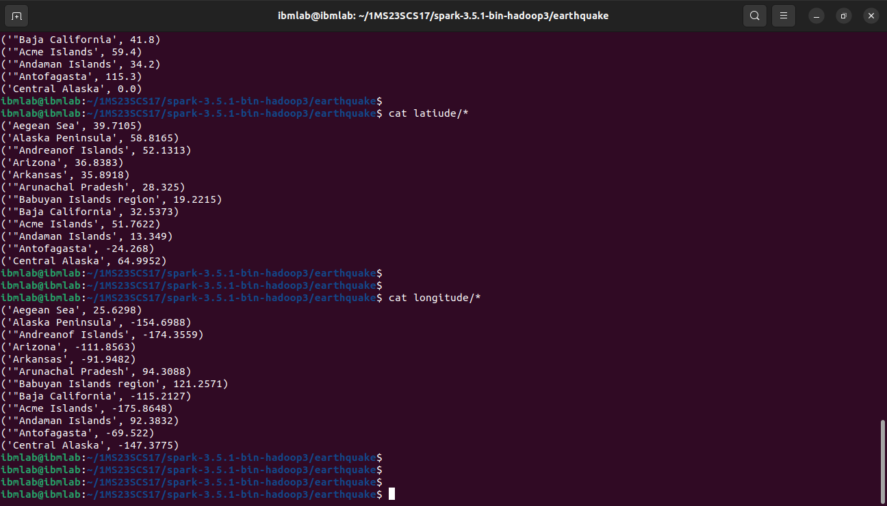

## `Program 2`

Write a spark program to analyze the given Earthquake Data and generate statistics with region and magnitude/ region and depth/ region and latitude/ region and longitude

### `Execution`

```sh
spark-submit earthquake.py earthquake-input.csv magnitude depth latitude longitude
```

### `Output`

```sh
cat magnitude/*
cat depth/*
```


```sh
cat latitude/*
cat longitude/*
```
