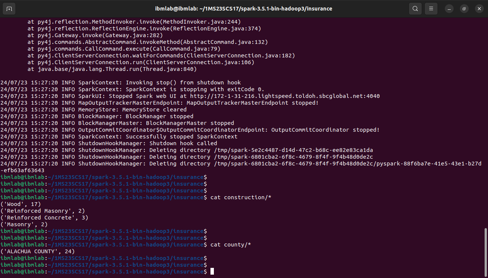

## `Program 3`

Write a spark program to analyze the given Insurance Data and generate a statistics report with the construction building name and the count of building/ county name and its frequency

### `Execution`

```sh
spark-submit insurance.py input-insurance.csv construction county
```

### `Output`

```sh
cat construction/*
cat county/*
```

