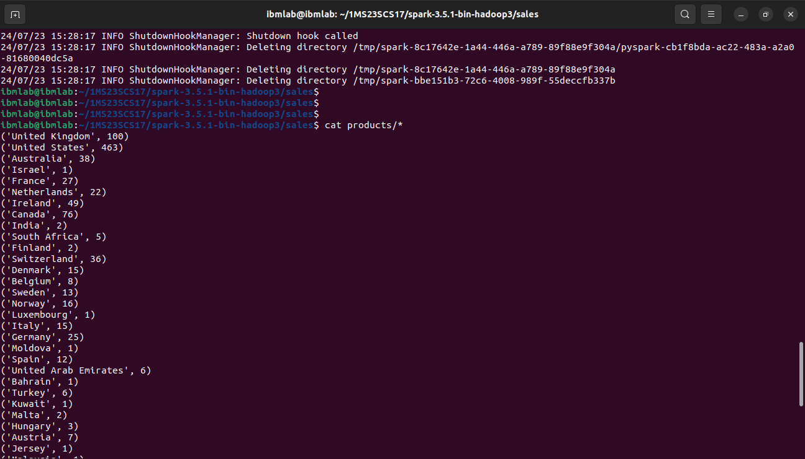
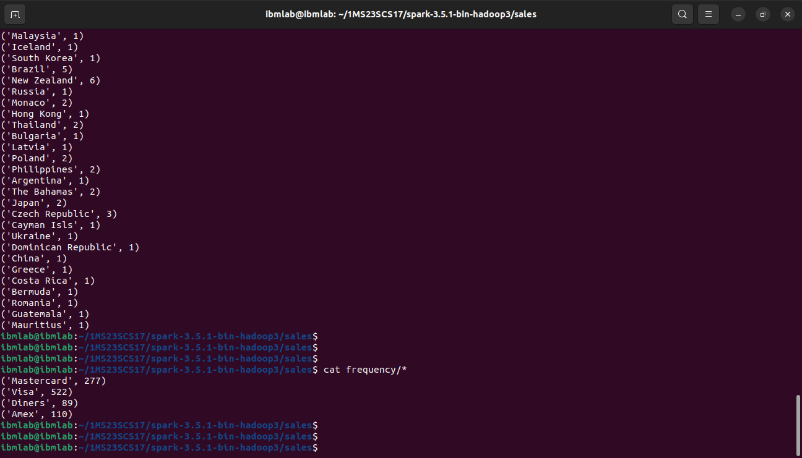

## `Program 4`

Write a spark program to analyze the given Sales Records over a period of time and generate data about the country’s total sales, and the total number of the products. / country’s total sales and the frequency of the payment mode

### `Execution`

```sh
spark-submit sales.py input-sales.csv products frequency
```

### `Output`

```sh
cat products/*
```



```sh
cat frequency/*
```
