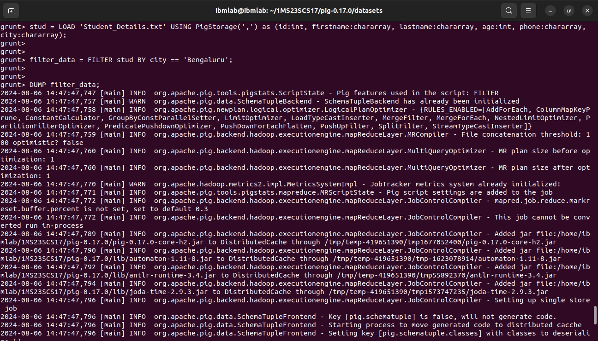
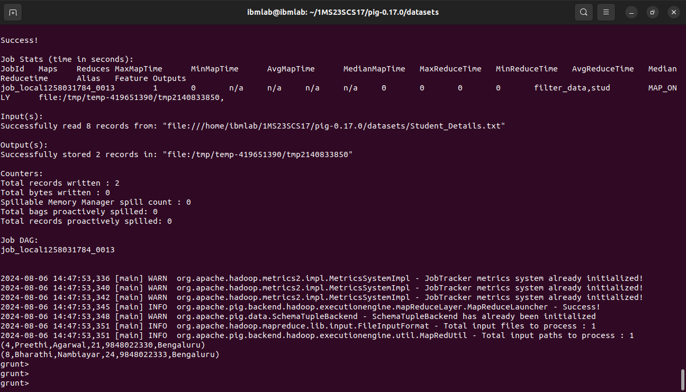
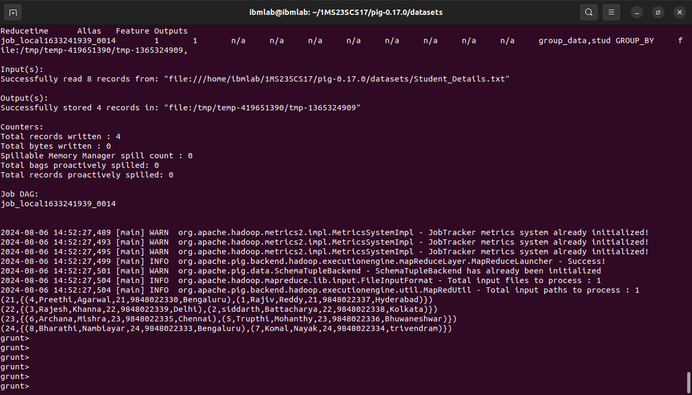

## `Program 1`

Write Pig Latin scripts to FILTER and GROUP Student_details.txt data.
* FILTER student details BY city == 'Bengaluru';
* GROUP student by age;

1. Load the datasets located in the same directory where `pig` command was called.
```sh
stud = LOAD 'Student_Details.txt' USING PigStorage(',') as (id:int, firstname:chararray, lastname:chararray, age:int, phone:chararray, city:chararray);
```


2. Perform `FILTER` operation according to city specific to **Bengaluru**, and display the output.
```sh
filter_data = FILTER stud BY city == 'Bengaluru';

DUMP filter_data;
```


3. Perform `GROUP` the data according to the `age` and display the output.
```sh
group_data = GROUP stud BY age;

DUMP group_data;
```

