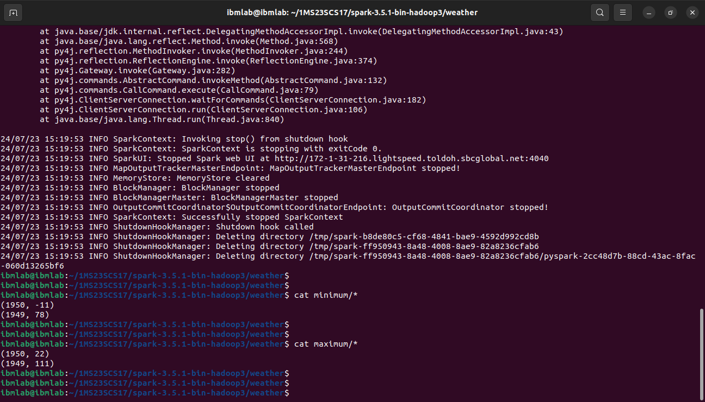

## `Program 1`

Write a spark program to analyze the given Weather Report Data and to generate a report with cities having maximum and minimum temperature for a particular year.  

### `Execution`

```sh
spark-submit weather.py input.txt minimum maximum
```

### `Output`

```sh
cat minimum/*
cat maximum/*
```

